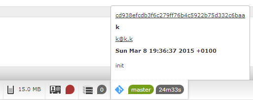
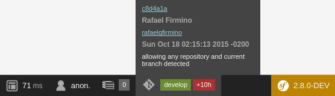

Symfony Debug Toolbar Git
=========================

   

 

  

## Symfony toolbar add-on

### Get the latest git commit into Symfony debug toolbar

And visualize quickly the latest commit into your repository by clicking on the **Commit ID**.

Information displayed :

+ **Branch** : active branch
+ **Time since last commit** : time since last commit at page generation  

1. less than one hour : minutes + seconds | colored in green, then in red :
2. more than one hour : hour(s)
3. more than 24h : count in days
4. more than 1 month : count in months

Useful for local development but also for a continuous integration (CI) process on a development server.

If no git repository have been initiated, there will be no display into the toolbar.

### Status information : mouse over

Information displayed :

+ **Commit ID** : links to the commit URL on your repository (Github, Bitbucket..), base url is to set into repository_commit_url parameter
+ **Merge** : merge IDs if there is
+ **Author**
+ **Email** : email with active link
+ **Date** : full date of latest commit
+ **Commit message**

## Installation

### Composer

    composer require kendrick/symfony-debug-toolbar-git

### Register into AppKernel

app/AppKernel.php :

    if (in_array($this->getEnvironment(), array('dev', 'test'))) {
        [...]
        $bundles[] = new Kendrick\SymfonyDebugToolbarGit\SymfonyDebugToolbarGit();
    
### Parameters

app/config/config_dev.yml :

    symfony_debug_toolbar_git:
        repository_commit_url: ""
        
repository_commit_url, ex : *https://bitbucket.org/team/project/commits/* or *https://github.com/user/project/commit/*
