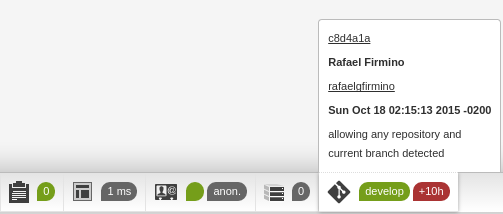

Symfony Debug Toolbar Git
=========================

   

 

## Symfony toolbar add-on

### Get the latest git commit into Symfony debug toolbar

Since release 1.3 : no icon (better integration for Symfony 2.8)

Information displayed :

+ **Branch** : active branch
+ **Time since last commit** : total time in minutes + seconds since last commit at page generation  

Useful for local development but also for a continuous integration (CI) process on a development server.

If no git repository have been initiated, there will be no display into the toolbar.

### Status information : mouse over

Information displayed :

+ **Commit ID** : links to the commit URL on your repository (Github, Bitbucket..), base url is to set into repository_commit_url parameter
+ **Merge** : merge IDs if there is
+ **Author**
+ **Email** : email with active link
+ **Date** : full date of latest commit
+ **Commit message**

## Installation

### Composer

composer require kendrick/symfony-debug-toolbar-git

In your composer.json :

    "require": {
        [...]
        "kendrick/symfony-debug-toolbar-git": "1.*"

Install or update :
    
Terminal alias or Command Line Tools Console of PHPStorm

    c install
    c update

No alias

    php composer.phar install
    php composer.phar update

### PHPStorm shortcut

Menu : Tools > Composer > Add dependency, then type part of the package name : kendrick/symfony-debug-toolbar-git.

### Register into AppKernel

app/AppKernel.php :

    if (in_array($this->getEnvironment(), array('dev', 'test'))) {
        [...]
        $bundles[] = new Kendrick\SymfonyDebugToolbarGit\SymfonyDebugToolbarGit();
    
### Parameters

app/config/config_dev.yml :

    symfony_debug_toolbar_git:
        repository_commit_url: ""
        
repository_commit_url, ex : *https://bitbucket.org/team/project/commits/* or *https://github.com/user/project/commit/*